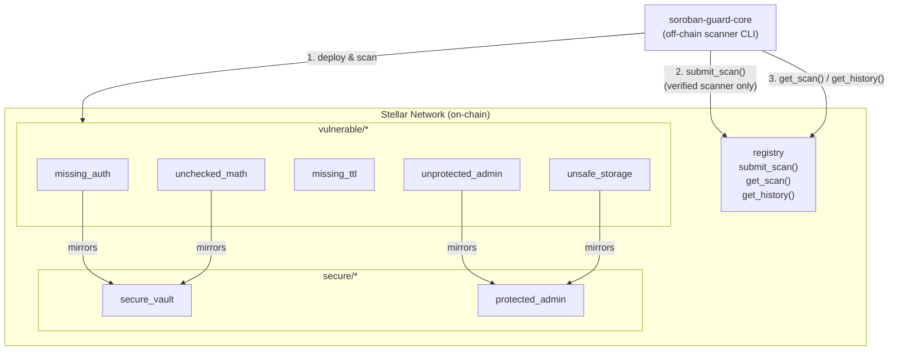

# soroban-guard-contracts

[](https://github.com/magaret457/soroban-guard-contracts/actions/workflows/ci.yml)
[](https://codecov.io/gh/magaret457/soroban-guard-contracts)

A library of sample Soroban smart contracts — both vulnerable and secure — used
for testing the [Soroban Guard](https://github.com/Veritas-Vaults-Network/soroban-guard-core)
scanner, plus an on-chain scan result registry.

Part of the [Veritas Vaults Network](https://github.com/Veritas-Vaults-Network) org.

---

## Sister repos

| Repo | Purpose |
|---|---|
| [soroban-guard-core](https://github.com/Veritas-Vaults-Network/soroban-guard-core) | CLI scanner |
| [soroban-guard-web](https://github.com/Veritas-Vaults-Network/soroban-guard-web) | Web dashboard |

---

## Project structure

```
soroban-guard-contracts/
├── vulnerable/
│   ├── missing_auth/       # transfer() with no require_auth()
│   ├── unchecked_math/     # staking rewards with raw u64 arithmetic
│   ├── missing_ttl/        # persistent balances expire because TTL is never renewed
│   ├── unprotected_admin/  # set_admin() / upgrade() open to anyone
│   └── unsafe_storage/     # public writes to any account's storage slot
├── secure/
│   ├── secure_vault/       # fixed token: auth + checked math
│   └── protected_admin/    # fixed admin + profile registry
├── registry/               # on-chain scan result registry contract
├── docs/
│   └── vulnerabilities.md  # explains each vulnerability with examples
├── CONTRIBUTING.md
└── Cargo.toml
```

---

## Contracts

### Vulnerable

| Crate | Context | Vulnerability |
|---|---|---|
| [`missing_auth`](./vulnerable/missing_auth/README.md) | Token contract | `transfer()` mutates balances without `require_auth()` |
| [`missing_ttl`](./vulnerable/missing_ttl/README.md) | Token contract | Persistent balances expire because the contract never calls `extend_ttl()` |
| [`unchecked_math`](./vulnerable/unchecked_math/README.md) | Staking contract | Reward calc uses raw `*` on `u64` — overflows silently |
| [`unprotected_admin`](./vulnerable/unprotected_admin/README.md) | Escrow contract | `set_admin()` and `upgrade()` have no caller check |
| [`unsafe_storage`](./vulnerable/unsafe_storage/README.md) | KYC registry | Any caller can write to any account's storage slot |
| [`admin_rugpull`](./vulnerable/admin_rugpull/README.md) | Admin contract | Single-step admin transfer with no acceptance confirmation |
| [`allowance_not_decremented`](./vulnerable/allowance_not_decremented/README.md) | Token contract | Allowance not reduced after `transfer_from` |
| [`call_depth`](./vulnerable/call_depth/README.md) | Cross-contract | Unbounded recursive calls exhaust the call stack |
| [`div_by_zero`](./vulnerable/div_by_zero/README.md) | Fee contract | Division by zero when pool or supply is empty |
| [`double_claim`](./vulnerable/double_claim/README.md) | Staking contract | Reward window never resets — same period claimed repeatedly |
| [`dust_griefing`](./vulnerable/dust_griefing/README.md) | Vault contract | No minimum deposit — storage bloated with dust entries |
| [`flash_loan_no_check`](./vulnerable/flash_loan_no_check/README.md) | Lending contract | Flash loan repayment not verified before returning |
| [`instant_oracle`](./vulnerable/instant_oracle/README.md) | DEX contract | Single-block oracle price is manipulable via flash loan |
| [`key_collision`](./vulnerable/key_collision/README.md) | Token contract | Different data types share the same storage key |
| [`leaky_events`](./vulnerable/leaky_events/README.md) | Registry contract | Sensitive data emitted in public contract events |
| [`missing_events`](./vulnerable/missing_events/README.md) | Token contract | No events emitted — off-chain indexers are blind |
| [`negative_transfer`](./vulnerable/negative_transfer/README.md) | Token contract | Negative amount reverses transfer direction |
| [`no_slippage`](./vulnerable/no_slippage/README.md) | DEX contract | No `min_out` guard — sandwich attacks extract value |
| [`reentrancy`](./vulnerable/reentrancy/README.md) | Vault contract | External call before state update enables re-entrancy |
| [`reinit_attack`](./vulnerable/reinit_attack/README.md) | Any contract | `initialize()` callable multiple times — admin replaced |
| [`replay_attack`](./vulnerable/replay_attack/README.md) | Signature contract | Signed messages not invalidated — replayable indefinitely |
| [`scanner_impersonation`](./vulnerable/scanner_impersonation/README.md) | Registry contract | Scanner address not verified against approved list |
| [`self_transfer`](./vulnerable/self_transfer/README.md) | Token contract | `from == to` corrupts balance accounting |
| [`sensitive_storage`](./vulnerable/sensitive_storage/README.md) | Registry contract | Secrets stored in publicly readable contract storage |
| [`stale_oracle`](./vulnerable/stale_oracle/README.md) | DEX contract | Oracle price used without staleness check |
| [`string_admin`](./vulnerable/string_admin/README.md) | Admin contract | Admin stored as `String` — bypasses `require_auth` |
| [`timestamp_lock`](./vulnerable/timestamp_lock/README.md) | Vault contract | Time-lock uses manipulable `ledger().timestamp()` |
| [`unbounded_storage`](./vulnerable/unbounded_storage/README.md) | Registry contract | Unbounded collection growth exhausts storage |
| [`uncapped_rate`](./vulnerable/uncapped_rate/README.md) | Staking contract | Reward rate has no upper bound — pool drainable |
| [`unchecked_math`](./vulnerable/unchecked_math/README.md) | Staking contract | Raw arithmetic overflows silently |
| [`underflow_transfer`](./vulnerable/underflow_transfer/README.md) | Token contract | Unchecked subtraction wraps balance to `u64::MAX` |
| [`unprotected_burn`](./vulnerable/unprotected_burn/README.md) | Token contract | `burn()` callable by anyone — destroys any account's tokens |
| [`unprotected_delete`](./vulnerable/unprotected_delete/README.md) | Any contract | Storage wipe callable without admin auth |
| [`unprotected_emergency_withdraw`](./vulnerable/unprotected_emergency_withdraw/README.md) | Vault contract | Emergency drain callable by any address |
| [`unprotected_fee_withdraw`](./vulnerable/unprotected_fee_withdraw/README.md) | DEX contract | Fee withdrawal open to any caller |
| [`unprotected_mint`](./vulnerable/unprotected_mint/README.md) | Token contract | `mint()` callable by anyone — unlimited supply inflation |
| [`unsafe_cast`](./vulnerable/unsafe_cast/README.md) | Token contract | Integer cast truncates or wraps silently |
| [`zero_admin`](./vulnerable/zero_admin/README.md) | Admin contract | Admin set to zero address — contract permanently locked |
| [`zero_deposit`](./vulnerable/zero_deposit/README.md) | Vault contract | Zero-value deposit accepted — storage griefing |
| [`zero_stake`](./vulnerable/zero_stake/README.md) | Staking contract | Zero-value stake accepted — division-by-zero risk |

### Secure

| Crate | Fixes |
|---|---|
| `secure_vault` | `require_auth` on transfer + `checked_sub`/`checked_add` |
| `protected_admin` | Admin auth on `set_admin`/`upgrade` + account auth on profile writes |

### Registry

`registry` — an on-chain contract that stores scan findings keyed by contract
address. Only verified scanners (managed by the admin) can submit results.
Supports full scan history per contract.

```
submit_scan(scanner, contract_address, findings_hash, severity_counts)
get_scan(contract_address) -> Option<ScanResult>
get_history(contract_address) -> Vec<ScanResult>
```

---

## Quick start

```bash
# Build all contracts
cargo build

# Run all tests
cargo test

# Run tests for a single contract
cargo test -p missing-auth
cargo test -p registry
```

See [CONTRIBUTING.md](./CONTRIBUTING.md) for full setup instructions and how to
add new vulnerable contract examples.

---

## Stellar blockchain integration

These contracts run on [Stellar](https://stellar.org) via the
[Soroban](https://soroban.stellar.org) smart contract platform. Below is the
full scaffold for deploying and interacting with them on Stellar Testnet.

### Network overview

```
Stellar Testnet
  RPC endpoint : https://soroban-testnet.stellar.org
  Network pass : Test SDF Network ; September 2015
  Explorer     : https://stellar.expert/explorer/testnet

Stellar Mainnet
  RPC endpoint : https://soroban-mainnet.stellar.org
  Network pass : Public Global Stellar Network ; September 2015
  Explorer     : https://stellar.expert/explorer/public
```

### 1. Prerequisites

```bash
# Rust + WASM target
rustup target add wasm32-unknown-unknown

# Stellar CLI
cargo install --locked stellar-cli --features opt

# Fund a testnet account (Friendbot)
stellar keys generate --global deployer --network testnet
stellar keys fund deployer --network testnet
```

### 2. Build optimised WASM

```bash
cargo build --release --target wasm32-unknown-unknown

# Compiled artefacts land at:
# target/wasm32-unknown-unknown/release/missing_auth.wasm
# target/wasm32-unknown-unknown/release/registry.wasm
# ... etc
```

### 3. Deploy a contract

```bash
# Deploy the scan result registry
stellar contract deploy \
  --wasm target/wasm32-unknown-unknown/release/registry.wasm \
  --source deployer \
  --network testnet

# Returns a contract address, e.g.:
# CXXXXXXXXXXXXXXXXXXXXXXXXXXXXXXXXXXXXXXXXXXXXXXXXXXXXXXXXXXXXXXX
export REGISTRY_ID=<contract-address>
```

### 4. Initialise the registry

```bash
stellar contract invoke \
  --id $REGISTRY_ID \
  --source deployer \
  --network testnet \
  -- initialize \
  --admin $(stellar keys address deployer)
```

### 5. Register a scanner

```bash
export SCANNER=$(stellar keys address deployer)

stellar contract invoke \
  --id $REGISTRY_ID \
  --source deployer \
  --network testnet \
  -- add_scanner \
  --scanner $SCANNER
```

### 6. Submit a scan result

```bash
stellar contract invoke \
  --id $REGISTRY_ID \
  --source deployer \
  --network testnet \
  -- submit_scan \
  --scanner $SCANNER \
  --contract_address <scanned-contract-address> \
  --findings_hash "e3b0c44298fc1c149afb" \
  --severity_counts '{"critical":1,"high":2,"medium":0,"low":3}'
```

### 7. Query scan results

```bash
# Latest result
stellar contract invoke \
  --id $REGISTRY_ID \
  --network testnet \
  -- get_scan \
  --contract_address <scanned-contract-address>

# Full history
stellar contract invoke \
  --id $REGISTRY_ID \
  --network testnet \
  -- get_history \
  --contract_address <scanned-contract-address>
```

### 8. Deploy a vulnerable contract (for scanner testing)

```bash
stellar contract deploy \
  --wasm target/wasm32-unknown-unknown/release/missing_auth.wasm \
  --source deployer \
  --network testnet

export VULN_ID=<contract-address>

# Mint some tokens
stellar contract invoke \
  --id $VULN_ID \
  --source deployer \
  --network testnet \
  -- mint \
  --to $(stellar keys address deployer) \
  --amount 1000000

# Demonstrate the vulnerability — transfer without auth
stellar contract invoke \
  --id $VULN_ID \
  --source deployer \
  --network testnet \
  -- transfer \
  --from $(stellar keys address deployer) \
  --to <any-address> \
  --amount 1000000
```

### Architecture diagram



### Vulnerability ↔ secure-crate pairing

| Vulnerability crate | Class | Secure mirror | Fix applied |
|---|---|---|---|
| `missing_auth` | Missing authorisation | `secure_vault` | `require_auth()` on transfer |
| `unchecked_math` | Integer overflow | `secure_vault` | `checked_mul` / `checked_add` |
| `missing_ttl` | Storage expiry | _(inline `secure.rs`)_ | `extend_ttl()` on every write |
| `unprotected_admin` | Privilege escalation | `protected_admin` | Admin auth on `set_admin` / `upgrade` |
| `unsafe_storage` | Unauthorised writes | `protected_admin` | Account auth on profile writes |
| `key_collision` | Storage key clash | _(inline `secure.rs`)_ | Namespaced storage keys |
| `admin_rugpull` | Admin rug-pull | _(inline `secure.rs`)_ | Two-step admin transfer |
| `zero_deposit` | Zero-value deposit | _(inline `secure.rs`)_ | Guard `amount > 0` |
| `dust_griefing` | Dust griefing | `secure/dust_griefing` | Minimum deposit threshold |
| `instant_oracle` | Oracle manipulation | _(inline `secure.rs`)_ | TWAP / multi-source oracle |
| `no_slippage` | Slippage | _(inline `secure.rs`)_ | `min_out` slippage guard |
| `flash_loan_no_check` | Flash-loan re-entry | _(inline `secure.rs`)_ | Repayment check before return |
| `leaky_events` | Sensitive data in events | _(inline `secure.rs`)_ | Emit only non-sensitive fields |
| `scanner_impersonation` | Scanner spoofing | _(inline `secure.rs`)_ | On-chain scanner registry check |
| `allowance_not_decremented` | Allowance bug | _(inline `secure.rs`)_ | Decrement allowance after spend |
| `double_claim` | Double-claim | — | Claim flag in storage |
| `div_by_zero` | Division by zero | — | Guard divisor `> 0` |
| `negative_transfer` | Negative amount | — | Reject `amount < 0` |
| `underflow_transfer` | Underflow | — | `checked_sub` |
| `unprotected_burn` | Unprotected burn | `secure/secure_burn` | `require_auth()` on burn |
| `unprotected_fee_withdraw` | Fee drain | `secure/protected_fee_withdraw` | Admin auth on fee withdrawal |
| `unprotected_delete` | Storage wipe | — | Admin auth on delete |
| `unprotected_emergency_withdraw` | Emergency drain | _(inline `secure.rs`)_ | Auth + time-lock |
| `self_transfer` | Self-transfer | — | Reject `from == to` |
| `reinit_attack` | Re-initialisation | — | Initialised flag guard |
| `reentrancy` | Re-entrancy | _(inline `secure.rs`)_ | Checks-effects-interactions |
| `zero_admin` | Zero address admin | — | Reject zero address |
| `string_admin` | String-typed admin | — | Use `Address` type |
| `zero_stake` | Zero-value stake | _(inline `secure.rs`)_ | Guard `amount > 0` |
| `timestamp_lock` | Timestamp manipulation | `secure/sequence_lock` | Ledger sequence instead of timestamp |
| `missing_events` | No events emitted | — | Emit structured events |

### Useful links

- [Soroban docs](https://soroban.stellar.org/docs)
- [Stellar CLI reference](https://developers.stellar.org/docs/tools/stellar-cli)
- [Soroban SDK (Rust)](https://docs.rs/soroban-sdk)
- [Stellar Testnet Friendbot](https://friendbot.stellar.org)
- [Stellar Expert explorer](https://stellar.expert)

---

## Vulnerability reference

See [docs/vulnerabilities.md](./docs/vulnerabilities.md) for a detailed
explanation of each vulnerability class with code examples and fixes.
