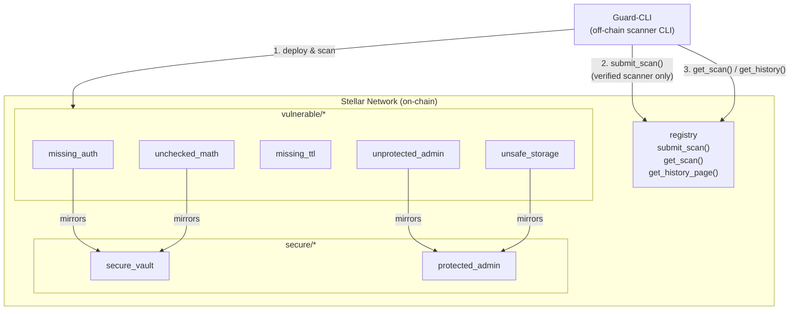

# Guard---Contracts

A library of sample Soroban smart contracts — both vulnerable and secure — used
for testing the Soroban Guard scanner, plus an on-chain scan result registry.

Part of the [SorobanGuard](https://github.com/SorobanGuard) org.

---

## Sister repos

| Repo | Purpose |
|---|---|
| [Guard-CLI](https://github.com/SorobanGuard/Guard-CLI) | CLI scanner |
| [Guard-Web](https://github.com/SorobanGuard/Guard-Web) | Web dashboard |

---

## Project structure

```
Guard---Contracts/
├── vulnerable/              # 188 crates, one per vulnerability class — see table below
│   ├── missing_auth/        # transfer() with no require_auth()
│   ├── unchecked_math/      # staking rewards with raw u64 arithmetic
│   ├── missing_ttl/         # persistent balances expire because TTL is never renewed
│   ├── unprotected_admin/   # set_admin() / upgrade() open to anyone
│   ├── unsafe_storage/      # public writes to any account's storage slot
│   └── ...                  # full list in "Contracts" below
├── secure/                  # 18 crates — fixed counterparts for a subset of vulnerable/
│   ├── secure_vault/        # fixed token: auth + checked math
│   ├── protected_admin/     # fixed admin + profile registry
│   └── ...
├── registry/                # on-chain scan result registry contract
├── docs/
│   └── vulnerabilities.md   # explains each vulnerability with examples
├── CONTRIBUTING.md
└── Cargo.toml
```

---

## Contracts

### Vulnerable

188 contracts, one per class of bug, each pairing 1:1 with a Cargo workspace member under `vulnerable/`. Full detail lives in each crate's `README.md` when present, otherwise in its `src/lib.rs` doc comment.

| Crate | Vulnerability |
|---|---|
| [`abs_min_overflow`](./vulnerable/abs_min_overflow/src/lib.rs) | Unchecked abs() on i128::MIN overflows — risk module computes wrong debt delta |
| [`abstain_counts_as_yes`](./vulnerable/abstain_counts_as_yes/src/lib.rs) | Support calculation treats abstain as yes |
| [`accept_admin_missing_auth`](./vulnerable/accept_admin_missing_auth/README.md) | `accept_admin()` never calls `require_auth` — anyone can finalise the pending-admin transfer |
| [`admin_rugpull`](./vulnerable/admin_rugpull/README.md) | Admin rugpull via unprotected upgrade |
| [`admin_skim_donations`](./vulnerable/admin_skim_donations/src/lib.rs) | Admin can skim any balance above accounting as donations, removing user-redeemable funds |
| [`admin_timelock_rewrite`](./vulnerable/admin_timelock_rewrite/src/lib.rs) | Admin Timelock Rewrite Attack — A timelock contract that stores only one pending action per target without binding the queue key to the payload hash |
| [`airdrop_campaign_collision`](./vulnerable/airdrop_campaign_collision/src/lib.rs) | Airdrop that keys claimed storage only by claimant address |
| [`airdrop_claim_before_start`](./vulnerable/airdrop_claim_before_start/src/lib.rs) | Airdrop claim ignores campaign start_ledger |
| [`airdrop_expiry_ignored`](./vulnerable/airdrop_expiry_ignored/src/lib.rs) | Airdrop that ignores expiry ledger |
| [`allowance_before_balance`](./vulnerable/allowance_before_balance/src/lib.rs) | `transfer_from` decrements the spender's allowance *before* checking the `from` account's balance |
| [`allowance_not_decremented`](./vulnerable/allowance_not_decremented/README.md) | Token contract where allowance is never decremented after transfer |
| [`asset_key_collision`](./vulnerable/asset_key_collision/README.md) | Multi-asset vault key collision |
| [`assumed_token_decimals`](./vulnerable/assumed_token_decimals/src/lib.rs) | Incorrect decimal assumption for multi-asset accounting |
| [`auction_close_early`](./vulnerable/auction_close_early/src/lib.rs) | Auction close before end ledger |
| [`auction_min_increment_missing`](./vulnerable/auction_min_increment_missing/src/lib.rs) | Missing minimum bid increment enforcement |
| [`auction_refund_block`](./vulnerable/auction_refund_block/src/lib.rs) | Inline refund blocking higher bids |
| [`audit_expiry_ignored`](./vulnerable/audit_expiry_ignored/src/lib.rs) | Audit expiry is stored but not checked by consumers |
| [`balance_key_missing_user`](./vulnerable/balance_key_missing_user/src/lib.rs) | Asset-only balance keys without user scoping |
| [`batch_partial_failure`](./vulnerable/batch_partial_failure/src/lib.rs) | Batch partial failure pattern |
| [`batch_pause_bypass`](./vulnerable/batch_pause_bypass/src/lib.rs) | Batch Operation Bypasses Pause Check — A token contract that checks the paused flag in individual transfer functions, but the bulk-transfer helper writes balances directly without pause validation |
| [`borrow_cap_asset_mixup`](./vulnerable/borrow_cap_asset_mixup/src/lib.rs) | Lending where borrow cap is global, not per-asset |
| [`borrow_without_accrual`](./vulnerable/borrow_without_accrual/src/lib.rs) | Borrow limit checked before interest accrual |
| [`bridge_chainid_missing`](./vulnerable/bridge_chainid_missing/src/lib.rs) | Bridge message replay across chains due to missing destination chain id |
| [`bridge_nonce_global`](./vulnerable/bridge_nonce_global/src/lib.rs) | Bridge nonce tracked globally instead of per source chain |
| [`bridge_partial_mint_replay`](./vulnerable/bridge_partial_mint_replay/src/lib.rs) | Bridge burn proof reusable after partial mint failure |
| [`bridge_validator_quorum_missing`](./vulnerable/bridge_validator_quorum_missing/src/lib.rs) | Bridge validator set update with no quorum check |
| [`buy_without_listing`](./vulnerable/buy_without_listing/src/lib.rs) | NFT marketplace buy does not require an active listing |
| [`call_depth`](./vulnerable/call_depth/README.md) | Unbounded call-depth exploitation |
| [`callback_before_invariant`](./vulnerable/callback_before_invariant/src/lib.rs) | External callback mutates state before invariant check |
| [`caller_supplied_ledger`](./vulnerable/caller_supplied_ledger/README.md) | Trusts caller-supplied current_ledger instead of env.ledger() |
| [`caller_supplied_withdraw_token`](./vulnerable/caller_supplied_withdraw_token/src/lib.rs) | `withdraw()` accepts an arbitrary caller-supplied payout token with no allow-list check — drains any token the contract holds |
| [`canceled_listing_fillable`](./vulnerable/canceled_listing_fillable/src/lib.rs) | Canceled listing remaining fillable via stale order key |
| [`collateral_factor_over_100`](./vulnerable/collateral_factor_over_100/src/lib.rs) | Lending fixture demonstrating collateral factors above 100% |
| [`collateral_withdraw_no_health_check`](./vulnerable/collateral_withdraw_no_health_check/src/lib.rs) | Lending contract that skips post-withdraw health checks |
| [`cross_call_error_swallowed`](./vulnerable/cross_call_error_swallowed/src/lib.rs) | Cross-contract error converted to success status |
| [`current_contract_admin`](./vulnerable/current_contract_admin/src/lib.rs) | Missing admin defaults to current contract address |
| [`delegate_signer_mismatch`](./vulnerable/delegate_signer_mismatch/src/lib.rs) | Delegate Signer Mismatch Allows Unauthorized Delegated Transfer — A token-like contract that accepts a `delegate` address parameter for delegated transfers but calls `owner.require_auth()` instead of `delegate.require_auth()`. This allows a malicious caller to consume another delegate's allowance because the signer and allowance spender are not bound together |
| [`delegation_weight_no_snapshot`](./vulnerable/delegation_weight_no_snapshot/src/lib.rs) | Governance contract with unsnapshot delegated voting weight |
| [`delete_without_tombstone`](./vulnerable/delete_without_tombstone/src/lib.rs) | Delete without tombstone allows stale-approval replay |
| [`deposit_cap_wrong_amount`](./vulnerable/deposit_cap_wrong_amount/src/lib.rs) | Deposit cap checked before fee-on-transfer delta |
| [`div_by_zero`](./vulnerable/div_by_zero/README.md) | Unguarded division by zero |
| [`double_claim`](./vulnerable/double_claim/README.md) | Double-claim of rewards |
| [`dust_griefing`](./vulnerable/dust_griefing/README.md) | Dust-griefing attack vector |
| [`emergency_delay_bypass`](./vulnerable/emergency_delay_bypass/src/lib.rs) | Emergency dispatcher does not restrict function selectors or targets |
| [`empty_vault_share_inflation`](./vulnerable/empty_vault_share_inflation/src/lib.rs) | Vault share inflation via first-deposit manipulation |
| [`epoch_claim_no_advance`](./vulnerable/epoch_claim_no_advance/src/lib.rs) | Epoch claim contract without epoch advance verification |
| [`escrow_balance_check`](./vulnerable/escrow_balance_check/src/lib.rs) | Escrow contract that releases funds without checking the escrow balance |
| [`even_median_bias`](./vulnerable/even_median_bias/README.md) | Even-number median picks lower price without manipulation guard |
| [`event_authority_spoof`](./vulnerable/event_authority_spoof/src/lib.rs) | Event authority spoofing |
| [`execute_without_queue`](./vulnerable/execute_without_queue/src/lib.rs) | Execution ignores queued state and execute-after ledger |
| [`expired_delegation`](./vulnerable/expired_delegation/src/lib.rs) | No Expiry on Admin Delegation — A contract that supports temporary admin delegation |
| [`fake_token_registration`](./vulnerable/fake_token_registration/README.md) | Fake token registration with untrusted metadata |
| [`fee_on_transfer`](./vulnerable/fee_on_transfer/src/lib.rs) | Fee-on-Transfer Accounting — A vault that credits users based on the `amount` parameter rather than the tokens actually received |
| [`fee_precision_loss`](./vulnerable/fee_precision_loss/src/lib.rs) | Fee bypass via integer division truncation |
| [`flash_fee_not_collected`](./vulnerable/flash_fee_not_collected/src/lib.rs) | Flash loan that calculates but never collects fees |
| [`flash_loan_no_check`](./vulnerable/flash_loan_no_check/README.md) | Flash loan with no repayment check |
| [`flash_receiver_unchecked`](./vulnerable/flash_receiver_unchecked/src/lib.rs) | Flash loan receiver not authenticated or verified |
| [`flash_repay_wrong_token`](./vulnerable/flash_repay_wrong_token/src/lib.rs) | Flash loan repayment checked against caller-supplied token instead of borrowed asset |
| [`free_share_rounding`](./vulnerable/free_share_rounding/src/lib.rs) | Vault: mint accepted even when required asset transfer rounds to zero |
| [`future_oracle_timestamp`](./vulnerable/future_oracle_timestamp/src/lib.rs) | Future oracle timestamp extending price validity |
| [`governance_target_unvalidated`](./vulnerable/governance_target_unvalidated/src/lib.rs) | Governance calls arbitrary unallowlisted targets |
| [`hardcoded_beneficiary`](./vulnerable/hardcoded_beneficiary/src/lib.rs) | Escrow Release Sends to Hardcoded Address — An escrow contract where `release` transfers funds to a compile-time constant address instead of reading the beneficiary from storage |
| [`ignored_return`](./vulnerable/ignored_return/src/lib.rs) | Ignored Return Value from Sub-Call — An escrow contract that calls an external token contract's `transfer()` to release funds to a recipient |
| [`inactive_circuit_breaker`](./vulnerable/inactive_circuit_breaker/src/lib.rs) | An inactive circuit breaker — max price-move threshold stored but never enforced |
| [`incomplete_blacklist`](./vulnerable/incomplete_blacklist/src/lib.rs) | Incomplete Blacklist — The token contract maintains a blacklist of addresses that should be blocked from transfers, but `transfer()` only checks whether the `to` address is blacklisted |
| [`instance_admin_storage`](./vulnerable/instance_admin_storage/src/lib.rs) | Admin Stored in Instance Storage — The contract stores the admin address using `env.storage().instance().set()` |
| [`instant_oracle`](./vulnerable/instant_oracle/README.md) | Instant/manipulable oracle price reads |
| [`interest_index_reset`](./vulnerable/interest_index_reset/src/lib.rs) | Borrow index reset when supply returns from zero |
| [`inverted_health_factor`](./vulnerable/inverted_health_factor/src/lib.rs) | Liquidation guard uses the wrong comparison direction |
| [`invoker_trusted_as_user`](./vulnerable/invoker_trusted_as_user/src/lib.rs) | Cross-contract callback trusts invoker as original user |
| [`key_collision`](./vulnerable/key_collision/README.md) | Storage key collision |
| [`leaky_events`](./vulnerable/leaky_events/README.md) | Sensitive data leaked via events |
| [`liquidation_dust_rounding`](./vulnerable/liquidation_dust_rounding/src/lib.rs) | Liquidation that allows dust bad debt through rounding |
| [`listing_price_signature_gap`](./vulnerable/listing_price_signature_gap/src/lib.rs) | Listing price can change after seller signature |
| [`merkle_duplicate_siblings`](./vulnerable/merkle_duplicate_siblings/src/lib.rs) | Merkle verifier that accepts malformed proofs with duplicate siblings |
| [`merkle_leaf_missing_amount`](./vulnerable/merkle_leaf_missing_amount/README.md) | Merkle leaf missing amount vulnerability |
| [`migration_version_skipped`](./vulnerable/migration_version_skipped/src/lib.rs) | Migration rewrites layout without an expected-version guard |
| [`missing_auth`](./vulnerable/missing_auth/README.md) | Token contract demonstrating missing require_auth on transfer |
| [`missing_escrow_auth`](./vulnerable/missing_escrow_auth/src/lib.rs) | Escrow deposit/withdraw stub — as shipped it's identical to `secure/secure_escrow` (both call `require_auth`); placeholder fixture, no live bug in current source |
| [`missing_events`](./vulnerable/missing_events/README.md) | Absence of required audit events |
| [`missing_ttl`](./vulnerable/missing_ttl/README.md) | Token contract where persistent storage TTL is never extended |
| [`mixed_collateral_decimals`](./vulnerable/mixed_collateral_decimals/src/lib.rs) | Collateral summed in raw token units without decimal normalisation |
| [`near_overflow_input`](./vulnerable/near_overflow_input/src/lib.rs) | Near-overflow attack via uncapped input amounts |
| [`negative_fee_bps`](./vulnerable/negative_fee_bps/src/lib.rs) | Negative Fee Basis Points — A fee contract that stores `fee_bps` as a signed integer and only caps the upper bound |
| [`negative_oracle_price`](./vulnerable/negative_oracle_price/src/lib.rs) | Negative signed oracle price cast to unsigned collateral value — wraps to huge amount |
| [`negative_transfer`](./vulnerable/negative_transfer/README.md) | Negative transfer amount exploit |
| [`nft_operator_collection_mixup`](./vulnerable/nft_operator_collection_mixup/src/lib.rs) | NFT operator approval scope mixup across collections |
| [`no_min_stake`](./vulnerable/no_min_stake/src/lib.rs) | Staking contract that accepts micro-stakes and allows storage pollution |
| [`no_slippage`](./vulnerable/no_slippage/README.md) | AMM contract with no slippage protection |
| [`nonzero_allowance_overwrite`](./vulnerable/nonzero_allowance_overwrite/README.md) | Token contract where approve overwrites nonzero allowance without reset |
| [`operator_role_not_enforced`](./vulnerable/operator_role_not_enforced/src/lib.rs) | Operator Role is Read but Never Enforced — A maintenance contract that stores an operator address for privileged actions but the protected function reads the role and continues execution even when the caller is not the operator. This makes the role storage decorative and exposes privileged actions to any caller |
| [`oracle_asset_mismatch`](./vulnerable/oracle_asset_mismatch/README.md) | Oracle feed asset id is not checked against requested asset |
| [`oracle_confidence_ignored`](./vulnerable/oracle_confidence_ignored/src/lib.rs) | Oracle confidence interval is discarded — low-confidence prices trigger liquidations as if reliable |
| [`oracle_price_scale_mismatch`](./vulnerable/oracle_price_scale_mismatch/src/lib.rs) | Oracle price exponent ignored — collateral inflated by orders of magnitude |
| [`oracle_source_unwhitelisted`](./vulnerable/oracle_source_unwhitelisted/src/lib.rs) | Caller-supplied oracle address is trusted — attacker deploys fake oracle to feed arbitrary prices |
| [`partial_config_clear`](./vulnerable/partial_config_clear/src/lib.rs) | Partial config updates clearing omitted fields |
| [`permit_deadline_ignored`](./vulnerable/permit_deadline_ignored/src/lib.rs) | Permit Deadline Ignored — A token contract where `permit` accepts a signed off-chain approval that includes a `deadline` field, but the contract never compares it against the current ledger timestamp. Expired signatures remain valid indefinitely |
| [`permit_domain_missing`](./vulnerable/permit_domain_missing/src/lib.rs) | Permit Domain Missing — A permit-style token where the signed payload contains only `(owner, spender, amount)` |
| [`proposal_id_collision`](./vulnerable/proposal_id_collision/src/lib.rs) | Duplicate proposal IDs overwrite voting state |
| [`public_archive_restore`](./vulnerable/public_archive_restore/src/lib.rs) | Restore lifecycle skips admin authorization |
| [`public_proposal_cancel`](./vulnerable/public_proposal_cancel/src/lib.rs) | Cancel marks proposals canceled without a permission check |
| [`public_role_grant`](./vulnerable/public_role_grant/README.md) | Public Role Grant (Unauthenticated Operator Escalation) — This crate is a focused Soroban fixture demonstrating a critical flaw: an entrypoint grants operator powers without admin authorization |
| [`public_token_sweep`](./vulnerable/public_token_sweep/README.md) | Unauthorized token sweep |
| [`quorum_current_supply`](./vulnerable/quorum_current_supply/src/lib.rs) | Governance contract using current supply instead of snapshot supply for quorum |
| [`rebasing_token_accounting`](./vulnerable/rebasing_token_accounting/src/lib.rs) | Rebasing-Token Accounting — A vault that tracks depositor shares using a fixed token-per-share ratio recorded at deposit time |
| [`recursive_hook_depth`](./vulnerable/recursive_hook_depth/src/lib.rs) | Recursive hook depth exhaustion |
| [`redundant_admin_set`](./vulnerable/redundant_admin_set/src/lib.rs) | Redundant Admin Set — `set_admin()` does not verify that `new_admin` differs from the current admin |
| [`reentrancy`](./vulnerable/reentrancy/README.md) | Reentrancy attack pattern |
| [`reinit_attack`](./vulnerable/reinit_attack/README.md) | Reinitialization attack |
| [`repay_for_reward_grief`](./vulnerable/repay_for_reward_grief/src/lib.rs) | Lending fixture demonstrating reward checkpoint grief via third-party repayment |
| [`replay_attack`](./vulnerable/replay_attack/README.md) | Replay attack via missing nonce |
| [`report_hash_unbound_contract`](./vulnerable/report_hash_unbound_contract/src/lib.rs) | Signed reports missing target contract binding |
| [`rescue_primary_asset`](./vulnerable/rescue_primary_asset/README.md) | Rescue function that can drain primary protocol asset |
| [`revoked_vesting_claim`](./vulnerable/revoked_vesting_claim/src/lib.rs) | Vesting contract that allows claims after revocation |
| [`reward_checkpoint_missing`](./vulnerable/reward_checkpoint_missing/README.md) | Stake() omits reward checkpoint — late depositors steal historical rewards |
| [`reward_debt_not_updated`](./vulnerable/reward_debt_not_updated/README.md) | Claim_rewards never updates reward_debt — same rewards claimable repeatedly |
| [`royalty_discount_miscalc`](./vulnerable/royalty_discount_miscalc/src/lib.rs) | Royalty calculated on post-discount price instead of sale price |
| [`royalty_recipient_mutable`](./vulnerable/royalty_recipient_mutable/src/lib.rs) | Mutable royalty recipient after listing receives bids |
| [`scan_result_overwrite`](./vulnerable/scan_result_overwrite/src/lib.rs) | Later scan results overwrite prior critical findings |
| [`scanner_fee_unverified`](./vulnerable/scanner_fee_unverified/src/lib.rs) | Unverified registration fee transfer in a scanner registry |
| [`scanner_impersonation`](./vulnerable/scanner_impersonation/README.md) | Scanner identity impersonation |
| [`scanner_metadata_unbounded`](./vulnerable/scanner_metadata_unbounded/src/lib.rs) | Unbounded metadata storage in a scanner registry |
| [`self_deposit`](./vulnerable/self_deposit/src/lib.rs) | Soroban token contract demonstrating locked funds from self-deposit transfers |
| [`self_fee_collector`](./vulnerable/self_fee_collector/src/lib.rs) | Fee collector can be set to the contract itself, trapping fees |
| [`self_stake`](./vulnerable/self_stake/src/lib.rs) | Self-Stake / Circular Balance Entry — A staking contract where `stake`, `unstake`, and `claim_rewards` do not validate that the staker differs from `env.current_contract_address()` |
| [`self_transfer`](./vulnerable/self_transfer/README.md) | Self-transfer balance manipulation |
| [`seller_self_purchase`](./vulnerable/seller_self_purchase/src/lib.rs) | Seller buying own listing to farm rewards |
| [`sensitive_storage`](./vulnerable/sensitive_storage/README.md) | Storing sensitive data in public storage |
| [`sequence_as_timestamp`](./vulnerable/sequence_as_timestamp/src/lib.rs) | Ledger sequence treated as timestamp units |
| [`severity_reporter_trust`](./vulnerable/severity_reporter_trust/src/lib.rs) | Unweighted severity trust from any scanner |
| [`signed_unsigned_wrap`](./vulnerable/signed_unsigned_wrap/src/lib.rs) | Signed i128 cast to u128 before positivity check — negative inputs become huge values |
| [`silent_admin_change`](./vulnerable/silent_admin_change/README.md) | Silent admin change with no event emission |
| [`single_approval_escrow_release`](./vulnerable/single_approval_escrow_release/src/lib.rs) | Escrow release with only one party approval |
| [`slash_without_evidence`](./vulnerable/slash_without_evidence/src/lib.rs) | Admin can slash scanner stake without any evidence record |
| [`stale_oracle`](./vulnerable/stale_oracle/README.md) | Stale oracle price acceptance |
| [`stale_pending_admin`](./vulnerable/stale_pending_admin/README.md) | Stale pending admin after cancellation |
| [`storage_namespace_omitted`](./vulnerable/storage_namespace_omitted/src/lib.rs) | Unrelated modules share the same storage symbol key |
| [`string_admin`](./vulnerable/string_admin/README.md) | Using a plain string as an admin identifier |
| [`temp_config_storage`](./vulnerable/temp_config_storage/src/lib.rs) | Critical configuration (admin, fee_rate, token address) is stored in `env.storage().temporary()` |
| [`timelock_eta_overwrite`](./vulnerable/timelock_eta_overwrite/src/lib.rs) | Timelock contract where queued execution eta can be overwritten |
| [`timelock_sequence`](./vulnerable/timelock_sequence/src/lib.rs) | Missing unlock ledger monotonicity checks |
| [`timestamp_lock`](./vulnerable/timestamp_lock/README.md) | Timestamp-based lock bypass |
| [`transfer_double_vote`](./vulnerable/transfer_double_vote/src/lib.rs) | Live balances allow the same tokens to vote twice |
| [`ttl_bump_index_only`](./vulnerable/ttl_bump_index_only/src/lib.rs) | TTL refresh updates index but not the paired record |
| [`twap_window_too_short`](./vulnerable/twap_window_too_short/src/lib.rs) | A TWAP window that can be set to one ledger, collapsing the average into a spot price |
| [`unbounded_loop`](./vulnerable/unbounded_loop/src/lib.rs) | Unbounded Loop — Instruction Limit DoS — An airdrop contract where `distribute_all()` iterates over every registered user in a single transaction |
| [`unbounded_storage`](./vulnerable/unbounded_storage/README.md) | Unbounded storage growth |
| [`uncapped_fee_bps`](./vulnerable/uncapped_fee_bps/src/lib.rs) | Uncapped Fee Basis Points — A fee contract that allows the admin to set `fee_bps` without an upper bound |
| [`uncapped_liquidation_bonus`](./vulnerable/uncapped_liquidation_bonus/src/lib.rs) | Liquidation payout uses unbounded bonus basis points |
| [`uncapped_rate`](./vulnerable/uncapped_rate/README.md) | Reward/interest rate has no upper bound — pool drainable |
| [`uncapped_supply`](./vulnerable/uncapped_supply/src/lib.rs) | Token Total Supply Not Tracked — A token contract with a `MAX_SUPPLY` constant that is never enforced |
| [`unchecked_fee_collector`](./vulnerable/unchecked_fee_collector/src/lib.rs) | Fee collector address accepted without validation |
| [`unchecked_kyc_level`](./vulnerable/unchecked_kyc_level/src/lib.rs) | Unchecked KYC Level — A KYC contract that stores a `kyc_level: u32` per user without validating that the value falls within the defined range (0–3) |
| [`unchecked_math`](./vulnerable/unchecked_math/README.md) | Staking contract with unchecked arithmetic overflow |
| [`underflow_transfer`](./vulnerable/underflow_transfer/README.md) | Integer underflow on transfer |
| [`underfunded_reward_pool`](./vulnerable/underfunded_reward_pool/src/lib.rs) | Underfunded Reward Pool — The staking contract's `claim_rewards` calculates the owed reward and transfers tokens without first verifying that the contract holds enough reward tokens |
| [`unprotected_admin`](./vulnerable/unprotected_admin/README.md) | Escrow contract with open set_admin and upgrade functions |
| [`unprotected_burn`](./vulnerable/unprotected_burn/README.md) | Allowing anyone to burn tokens |
| [`unprotected_delete`](./vulnerable/unprotected_delete/README.md) | Allowing anyone to delete storage entries |
| [`unprotected_emergency_withdraw`](./vulnerable/unprotected_emergency_withdraw/README.md) | Emergency drain callable by any address |
| [`unprotected_fee_withdraw`](./vulnerable/unprotected_fee_withdraw/README.md) | Fee withdrawal open to any caller |
| [`unprotected_mint`](./vulnerable/unprotected_mint/README.md) | Allowing anyone to mint tokens |
| [`unprotected_pause`](./vulnerable/unprotected_pause/src/lib.rs) | Unprotected Pause — A token contract where `pause()` and `unpause()` have no admin auth check |
| [`unprotected_upgrade`](./vulnerable/unprotected_upgrade/src/lib.rs) | Counter contract with an unprotected upgrade() function |
| [`unsafe_cast`](./vulnerable/unsafe_cast/README.md) | Unsafe integer casting |
| [`unsafe_storage`](./vulnerable/unsafe_storage/README.md) | KYC registry allowing writes to any account's storage |
| [`untrusted_oracle_setter`](./vulnerable/untrusted_oracle_setter/src/lib.rs) | Oracle address stored without allowlist validation |
| [`unvalidated_plugin_call`](./vulnerable/unvalidated_plugin_call/src/lib.rs) | Unvalidated plugin call pattern |
| [`unwrap_without_burn`](./vulnerable/unwrap_without_burn/README.md) | Unwrap without burning wrapper shares |
| [`upgrade_version_downgrade`](./vulnerable/upgrade_version_downgrade/src/lib.rs) | Upgrade contract that accepts lower implementation versions |
| [`validator_commission_uncapped`](./vulnerable/validator_commission_uncapped/src/lib.rs) | Validator contract with uncapped commission |
| [`vault_donation_accounting`](./vulnerable/vault_donation_accounting/src/lib.rs) | Donation-based share price manipulation |
| [`verifier_threshold_ignored`](./vulnerable/verifier_threshold_ignored/src/lib.rs) | Verifier threshold is configured but not enforced |
| [`vesting_claimed_not_subtracted`](./vulnerable/vesting_claimed_not_subtracted/src/lib.rs) | Vesting contract that pays full vested amount on every claim |
| [`vesting_cliff_after_end`](./vulnerable/vesting_cliff_after_end/src/lib.rs) | Vesting accepts cliff_ledger after end_ledger |
| [`vote_after_deadline`](./vulnerable/vote_after_deadline/src/lib.rs) | Voting contract that accepts votes after the proposal deadline |
| [`weak_randomness`](./vulnerable/weak_randomness/src/lib.rs) | Front-Running via Predictable Randomness — A lottery contract where the winner is determined by `env.ledger().sequence() % participants.len()` |
| [`withdraw_rounding_leak`](./vulnerable/withdraw_rounding_leak/src/lib.rs) | Vault: withdrawal rounds shares burned down, leaking value |
| [`wrapped_asset_allowlist_bypass`](./vulnerable/wrapped_asset_allowlist_bypass/src/lib.rs) | Token allowlist bypassed via wrapped asset address |
| [`zero_admin`](./vulnerable/zero_admin/README.md) | Accepts a zero address as admin — contract permanently locked |
| [`zero_deposit`](./vulnerable/zero_deposit/README.md) | Accepts zero-value deposits — storage griefing |
| [`zero_init_reward_rate`](./vulnerable/zero_init_reward_rate/src/lib.rs) | The staking contract's `initialize` function accepts `reward_rate = 0` without complaint |
| [`zero_reward_rate`](./vulnerable/zero_reward_rate/src/lib.rs) | The staking contract lets the admin set the reward rate to `0` |
| [`zero_share_rounding`](./vulnerable/zero_share_rounding/src/lib.rs) | Vault: deposit accepted even when computed shares round to zero |
| [`zero_stake`](./vulnerable/zero_stake/README.md) | Staking contract that accepts zero-value stakes |
| [`zero_stake_amount`](./vulnerable/zero_stake_amount/README.md) | Staking contract that accepts zero and negative stake amounts |
| [`zero_ttl`](./vulnerable/zero_ttl/src/lib.rs) | Zero TTL Immediately Expires Storage — The contract exposes a `set_ttl` admin function that accepts any `u32` value including zero |
| [`zero_wasm_hash`](./vulnerable/zero_wasm_hash/src/lib.rs) | Zero WASM Hash Accepted in Upgrade — A contract whose `upgrade` function accepts a `BytesN<32>` WASM hash without validating that it is non-zero |

### Secure

Fixed counterparts under `secure/`. Not every vulnerable crate has a dedicated secure mirror yet — see the [pairing table](#vulnerability--secure-crate-pairing) below for which do.

| Crate | Fix |
|---|---|
| [`dust_griefing`](./secure/dust_griefing/src/lib.rs) | Dust-griefing mitigation |
| [`paginated_airdrop`](./secure/paginated_airdrop/src/lib.rs) | Paginated Airdrop — Bounded Per-Transaction Work — Fixes the unbounded-loop vulnerability by replacing `distribute_all()` with `distribute_batch(start, count)` |
| [`protected_admin`](./secure/protected_admin/src/lib.rs) | Admin auth on set_admin, upgrade, and profile writes |
| [`protected_fee_withdraw`](./secure/protected_fee_withdraw/src/lib.rs) | Protected fee withdrawal |
| [`protected_oracle`](./secure/protected_oracle/src/lib.rs) | Secure mirror of `instant_oracle` — requires `MIN_DELAY` ledgers between a price update and its consumption, blocking same-ledger flash-loan price manipulation |
| [`secure_airdrop`](./secure/secure_airdrop/src/lib.rs) | Merkle-proof-based airdrop — Eligible addresses claim tokens by supplying a Merkle proof against a root stored at initialisation |
| [`secure_burn`](./secure/secure_burn/src/lib.rs) | Authenticated token burn |
| [`secure_dao`](./secure/secure_dao/src/lib.rs) | On-chain DAO with quorum, vote-weight snapshots (anti flash-loan-governance), and a timelock between queue and execute |
| [`secure_escrow`](./secure/secure_escrow/src/lib.rs) | Escrow deposit/withdraw with `require_auth` required on both the depositor and withdrawer |
| [`secure_lending`](./secure/secure_lending/src/lib.rs) | Lending reference with collateral and liquidation checks |
| [`secure_multisig`](./secure/secure_multisig/src/lib.rs) | Multisig contract requiring threshold approvals |
| [`secure_pausable`](./secure/secure_pausable/src/lib.rs) | Admin-controlled pause mechanism |
| [`secure_staking`](./secure/secure_staking/src/lib.rs) | Secure mirror of `unchecked_math` — checked arithmetic, admin-gated rate, TTL extension |
| [`secure_token`](./secure/secure_token/src/lib.rs) | Token contract with auth and checked arithmetic |
| [`secure_transfer`](./secure/secure_transfer/src/lib.rs) | Transfer contract with full auth and validation |
| [`secure_vault`](./secure/secure_vault/src/lib.rs) | Vault with require_auth on transfer and checked arithmetic |
| [`secure_vesting`](./secure/secure_vesting/src/lib.rs) | Vesting contract with cliff, linear vesting, and admin revoke |
| [`sequence_lock`](./secure/sequence_lock/src/lib.rs) | Using sequence numbers to prevent replay attacks |

### Registry

`registry` — an on-chain contract that stores scan findings keyed by contract
address. Only verified scanners (managed by the admin) can submit results.
Supports full scan history per contract.

```
submit_scan(scanner, contract_address, findings_hash, severity_counts)
get_scan(contract_address) -> Option<ScanResult>
get_history_page(contract_address, offset, limit) -> Vec<ScanResult>  // limit capped at 50
get_history_len(contract_address) -> u32
```

---

## Quick start

```bash
# Build all contracts
cargo build

# Run all tests
cargo test

# Run tests for a single contract
cargo test -p missing-auth
cargo test -p registry
```

See [CONTRIBUTING.md](./CONTRIBUTING.md) for full setup instructions and how to
add new vulnerable contract examples.

---

## Stellar blockchain integration

These contracts run on [Stellar](https://stellar.org) via the
[Soroban](https://soroban.stellar.org) smart contract platform. Below is the
full scaffold for deploying and interacting with them on Stellar Testnet.

### Network overview

```
Stellar Testnet
  RPC endpoint : https://soroban-testnet.stellar.org
  Network pass : Test SDF Network ; September 2015
  Explorer     : https://stellar.expert/explorer/testnet

Stellar Mainnet
  RPC endpoint : https://soroban-mainnet.stellar.org
  Network pass : Public Global Stellar Network ; September 2015
  Explorer     : https://stellar.expert/explorer/public
```

### 1. Prerequisites

```bash
# Rust + WASM target
rustup target add wasm32-unknown-unknown

# Stellar CLI
cargo install --locked stellar-cli --features opt

# Fund a testnet account (Friendbot)
stellar keys generate --global deployer --network testnet
stellar keys fund deployer --network testnet
```

### 2. Build optimised WASM

```bash
cargo build --release --target wasm32-unknown-unknown

# Compiled artefacts land at:
# target/wasm32-unknown-unknown/release/missing_auth.wasm
# target/wasm32-unknown-unknown/release/registry.wasm
# ... etc
```

### 3. Deploy a contract

```bash
# Deploy the scan result registry
stellar contract deploy \
  --wasm target/wasm32-unknown-unknown/release/registry.wasm \
  --source deployer \
  --network testnet

# Returns a contract address, e.g.:
# CXXXXXXXXXXXXXXXXXXXXXXXXXXXXXXXXXXXXXXXXXXXXXXXXXXXXXXXXXXXXXXX
export REGISTRY_ID=<contract-address>
```

### 4. Initialise the registry

```bash
stellar contract invoke \
  --id $REGISTRY_ID \
  --source deployer \
  --network testnet \
  -- initialize \
  --admin $(stellar keys address deployer)
```

### 5. Register a scanner

```bash
export SCANNER=$(stellar keys address deployer)

stellar contract invoke \
  --id $REGISTRY_ID \
  --source deployer \
  --network testnet \
  -- add_scanner \
  --scanner $SCANNER
```

### 6. Submit a scan result

```bash
stellar contract invoke \
  --id $REGISTRY_ID \
  --source deployer \
  --network testnet \
  -- submit_scan \
  --scanner $SCANNER \
  --contract_address <scanned-contract-address> \
  --findings_hash "e3b0c44298fc1c149afb" \
  --severity_counts '{"critical":1,"high":2,"medium":0,"low":3}'
```

### 7. Query scan results

```bash
# Latest result
stellar contract invoke \
  --id $REGISTRY_ID \
  --network testnet \
  -- get_scan \
  --contract_address <scanned-contract-address>

# Full history (unbounded)
stellar contract invoke \
  --id $REGISTRY_ID \
  --network testnet \
  -- get_history \
  --contract_address <scanned-contract-address>

# History page (offset=0, limit capped at 50)
stellar contract invoke \
  --id $REGISTRY_ID \
  --network testnet \
  -- get_history_page \
  --contract_address <scanned-contract-address> \
  --offset 0 \
  --limit 50

# Number of scans on record for a contract
stellar contract invoke \
  --id $REGISTRY_ID \
  --network testnet \
  -- get_history_len \
  --contract_address <scanned-contract-address>

# Contracts whose latest scan has >= 1 critical and >= 2 high findings (page 0, 20/page)
stellar contract invoke \
  --id $REGISTRY_ID \
  --network testnet \
  -- get_scans_by_min_severity \
  --min_critical 1 \
  --min_high 2 \
  --page 0 \
  --page_size 20

# Latest scan for up to 20 contracts in one call
stellar contract invoke \
  --id $REGISTRY_ID \
  --network testnet \
  -- get_latest_scans_batch \
  --contracts '["<contract-1>","<contract-2>"]'

# Every contract that has ever been scanned
stellar contract invoke \
  --id $REGISTRY_ID \
  --network testnet \
  -- get_all_scanned_contracts

# Paged view of scanned contracts (page 0, 20/page)
stellar contract invoke \
  --id $REGISTRY_ID \
  --network testnet \
  -- get_scanned_contracts_page \
  --page 0 \
  --page_size 20
```

### 8. Scanner administration and reputation

```bash
# Check whether an address is an approved scanner
stellar contract invoke \
  --id $REGISTRY_ID \
  --network testnet \
  -- is_scanner \
  --scanner $SCANNER

# Revoke a scanner's approval (admin only)
stellar contract invoke \
  --id $REGISTRY_ID \
  --source deployer \
  --network testnet \
  -- remove_scanner \
  --scanner $SCANNER

# Dispute a scanner's submission — decrements its reputation score (admin only)
stellar contract invoke \
  --id $REGISTRY_ID \
  --source deployer \
  --network testnet \
  -- dispute_scan \
  --scanner $SCANNER

# Read a scanner's reputation score (+1 per accepted submit_scan, -1 per dispute_scan)
stellar contract invoke \
  --id $REGISTRY_ID \
  --network testnet \
  -- get_scanner_score \
  --scanner $SCANNER

# Read the registry's admin address
stellar contract invoke \
  --id $REGISTRY_ID \
  --network testnet \
  -- get_admin
```

### 9. Contract metadata

Only the scanner that submitted the most recent scan for a contract may set its
metadata.

```bash
stellar contract invoke \
  --id $REGISTRY_ID \
  --source deployer \
  --network testnet \
  -- set_metadata \
  --scanner $SCANNER \
  --contract_address <scanned-contract-address> \
  --metadata '{"name":"MyToken","version":"1.0.0","audit_date":1735689600,"repo_url":"https://github.com/example/my-token"}'

stellar contract invoke \
  --id $REGISTRY_ID \
  --network testnet \
  -- get_metadata \
  --contract_address <scanned-contract-address>
```

### 10. Deploy a vulnerable contract (for scanner testing)

```bash
stellar contract deploy \
  --wasm target/wasm32-unknown-unknown/release/missing_auth.wasm \
  --source deployer \
  --network testnet

export VULN_ID=<contract-address>

# Mint some tokens
stellar contract invoke \
  --id $VULN_ID \
  --source deployer \
  --network testnet \
  -- mint \
  --to $(stellar keys address deployer) \
  --amount 1000000

# Demonstrate the vulnerability — transfer without auth
stellar contract invoke \
  --id $VULN_ID \
  --source deployer \
  --network testnet \
  -- transfer \
  --from $(stellar keys address deployer) \
  --to <any-address> \
  --amount 1000000
```

### Registry contract API reference

Every public entry point exposed by `registry` (see
[`registry/src/lib.rs`](./registry/src/lib.rs)):

| Function | Signature | Auth | Description |
|---|---|---|---|
| `initialize` | `(admin: Address)` | none (one-time) | Sets the admin. Panics if already initialized. |
| `add_scanner` | `(scanner: Address)` | admin | Approves a scanner address. |
| `remove_scanner` | `(scanner: Address)` | admin | Revokes a scanner's approval. |
| `is_scanner` | `(scanner: Address) -> bool` | none | Checks approval status. |
| `submit_scan` | `(scanner: Address, contract_address: Address, findings_hash: String, severity_counts: Map<String, u32>)` | scanner (`require_auth`) | Records a scan result; rejects unapproved scanners, deactivated contracts, and empty hashes. |
| `dispute_scan` | `(scanner: Address)` | admin | Decrements a scanner's reputation score by 1. |
| `get_scanner_score` | `(scanner: Address) -> i32` | none | Reputation score (+1 per accepted `submit_scan`, -1 per `dispute_scan`). |
| `get_scan` | `(contract_address: Address) -> Option<ScanResult>` | none | Latest scan result for a contract. |
| `get_history` | `(contract_address: Address) -> Vec<ScanResult>` | none | Full, unbounded scan history for a contract. |
| `get_history_page` | `(contract_address: Address, offset: u32, limit: u32) -> Vec<ScanResult>` | none | Bounded page of history, oldest to newest; `limit` capped at 50. |
| `get_history_len` | `(contract_address: Address) -> u32` | none | Number of scans on record for a contract. |
| `get_scans_by_min_severity` | `(min_critical: u32, min_high: u32, page: u32, page_size: u32) -> Vec<Address>` | none | Contracts whose latest scan meets both severity thresholds; `page_size = 0` returns all matches. |
| `get_latest_scans_batch` | `(contracts: Vec<Address>) -> Vec<Option<ScanResult>>` | none | Latest scan per contract in one call; panics above 20 addresses. |
| `get_all_scanned_contracts` | `() -> Vec<Address>` | none | Every contract address with at least one scan. |
| `get_scanned_contracts_page` | `(page: u32, page_size: u32) -> Vec<Address>` | none | Paged view of the same index. |
| `get_admin` | `() -> Address` | none | Current admin address. |
| `set_metadata` | `(scanner: Address, contract_address: Address, metadata: ContractMetadata)` | scanner (`require_auth`, must be the contract's latest scanner) | Attaches `{ name, version, audit_date, repo_url }` to a scanned contract. |
| `get_metadata` | `(contract_address: Address) -> Option<ContractMetadata>` | none | Reads metadata set by `set_metadata`. |

### Architecture diagram


```mermaid
flowchart TD
    subgraph Stellar["Stellar Network (on-chain)"]
        subgraph vuln["vulnerable/*"]
            V1[missing_auth]
            V2[unchecked_math]
            V3[missing_ttl]
            V4[unprotected_admin]
            V5[unsafe_storage]
        end

        subgraph sec["secure/*"]
            S1[secure_vault]
            S2[protected_admin]
        end

        REG["registry\nsubmit_scan()\nget_scan()\nget_history_page()"]
    end

    CLI["Guard-CLI\n(off-chain scanner CLI)"]

    V1 -- mirrors --> S1
    V2 -- mirrors --> S1
    V4 -- mirrors --> S2
    V5 -- mirrors --> S2

    CLI -- "1. deploy & scan" --> vuln
    CLI -- "2. submit_scan()\n(verified scanner only)" --> REG
    CLI -- "3. get_scan() / get_history()" --> REG
```

### Vulnerability ↔ secure-crate pairing

| Vulnerability crate | Class | Secure mirror | Fix applied |
|---|---|---|---|
| `missing_auth` | Missing authorisation | `secure_vault` | `require_auth()` on transfer |
| `unchecked_math` | Integer overflow | `secure_vault` | `checked_mul` / `checked_add` |
| `missing_ttl` | Storage expiry | _(inline `secure.rs`)_ | `extend_ttl()` on every write |
| `unprotected_admin` | Privilege escalation | `protected_admin` | Admin auth on `set_admin` / `upgrade` |
| `unsafe_storage` | Unauthorised writes | `protected_admin` | Account auth on profile writes |
| `key_collision` | Storage key clash | _(inline `secure.rs`)_ | Namespaced storage keys |
| `admin_rugpull` | Admin rug-pull | _(inline `secure.rs`)_ | Two-step admin transfer |
| `zero_deposit` | Zero-value deposit | _(inline `secure.rs`)_ | Guard `amount > 0` |
| `dust_griefing` | Dust griefing | `secure/dust_griefing` | Minimum deposit threshold |
| `instant_oracle` | Oracle manipulation | _(inline `secure.rs`)_ | TWAP / multi-source oracle |
| `no_slippage` | Slippage | _(inline `secure.rs`)_ | `min_out` slippage guard |
| `flash_loan_no_check` | Flash-loan re-entry | _(inline `secure.rs`)_ | Repayment check before return |
| `leaky_events` | Sensitive data in events | _(inline `secure.rs`)_ | Emit only non-sensitive fields |
| `scanner_impersonation` | Scanner spoofing | _(inline `secure.rs`)_ | On-chain scanner registry check |
| `allowance_not_decremented` | Allowance bug | _(inline `secure.rs`)_ | Decrement allowance after spend |
| `double_claim` | Double-claim | — | Claim flag in storage |
| `div_by_zero` | Division by zero | — | Guard divisor `> 0` |
| `negative_transfer` | Negative amount | — | Reject `amount < 0` |
| `underflow_transfer` | Underflow | — | `checked_sub` |
| `unprotected_burn` | Unprotected burn | `secure/secure_burn` | `require_auth()` on burn |
| `unprotected_fee_withdraw` | Fee drain | `secure/protected_fee_withdraw` | Admin auth on fee withdrawal |
| `unprotected_delete` | Storage wipe | — | Admin auth on delete |
| `unprotected_emergency_withdraw` | Emergency drain | _(inline `secure.rs`)_ | Auth + time-lock |
| `self_transfer` | Self-transfer | — | Reject `from == to` |
| `reinit_attack` | Re-initialisation | — | Initialised flag guard |
| `reentrancy` | Re-entrancy | _(inline `secure.rs`)_ | Checks-effects-interactions |
| `zero_admin` | Zero address admin | — | Reject zero address |
| `string_admin` | String-typed admin | — | Use `Address` type |
| `zero_stake` | Zero-value stake | _(inline `secure.rs`)_ | Guard `amount > 0` |
| `timestamp_lock` | Timestamp manipulation | `secure/sequence_lock` | Ledger sequence instead of timestamp |
| `missing_events` | No events emitted | — | Emit structured events |
| `reward_debt_not_updated` | Reward debt not updated | _(inline `secure.rs`)_ | Update debt after payout |
| `reward_checkpoint_missing` | Reward checkpoint missing | _(inline `secure.rs`)_ | Snapshot accumulator on deposit |

### Useful links

- [Soroban docs](https://soroban.stellar.org/docs)
- [Stellar CLI reference](https://developers.stellar.org/docs/tools/stellar-cli)
- [Soroban SDK (Rust)](https://docs.rs/soroban-sdk)
- [Stellar Testnet Friendbot](https://friendbot.stellar.org)
- [Stellar Expert explorer](https://stellar.expert)

---

## Vulnerability reference

See [docs/vulnerabilities.md](./docs/vulnerabilities.md) for a detailed
explanation of each vulnerability class with code examples and fixes.
